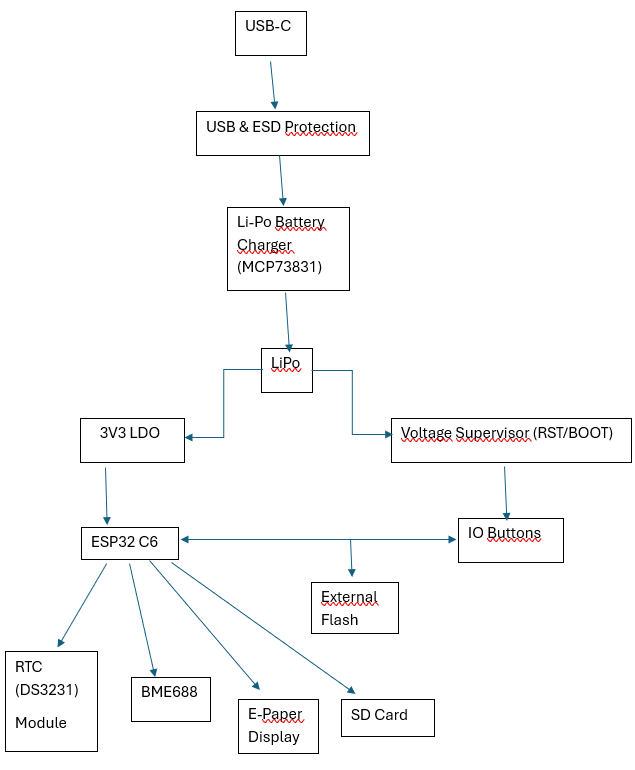

**Descriere functionalitate hardware**

Proiectul are la baza microcontroller-ul ESP32-C6, care gestioneaza comunicarea cu toate componentele externe si senzorii conectati. Acest microcontroller ofera conectivitate Wifi si Bluetooth dar si suport pentru interfetele SPI, I2C si UART. Este conectat la 3.3V printr-un regulator de tensiune LDO, acesta primind energie de la o baterie Li-po de 3.7V.
Afisarea informatiile se face utilizand un display E-Paper care este conectat prin inteerfata SPI, oferind un consum redus de energie, acstea fiind mai activ doar cand se fac actualizari pentru ecran. Informatiile pe care le va afisa sunt data, ora, valori senzori etc.
Monitorizarea mediului se face cu ajutorul senzorului BME688, acesta masurand temperatura, umiditatea dar si presiunea atmosferica. Comunica cu microcontroller-ul prin magistrala I2C.
Modulul RTC DS3231 este conectat tot la I2C si mentine ora si data exacta, chiar daca sistemul va fi oprit.
Prin portul USB-C se va face alimentarea sistemuluo care este conectat la circuitul de incarcare de baterie, acesta folosind MCP73831 si astfel controland incarcarea bateriei Li-Po. Tensiunea va fi stabilita la 3.3V pentru alimentarea senzorilor si a microcontroller-ului. 
Circuitul MAX17048 este folosit pentru a monitoriza nivelul incarcarii bateriei si ofera informatii despre tensiune si starea de incarcare prin I2C.
Consumul de energie este dat de ESP32-C6 care va putea sa intre in modul de consum redus si permite functionarea pe termen lung a bateriei. Consumul in regim activ este facut in functie de sarcinile si componentele active in acel moment.
Pentru a stoca, sistemul va folosi o memorie externa de tip NOR Flash conectata cu ajutorul lui SPI dar vom avea si un slot de card SD. Acesta va fi folosit pentru a loga local datele. Butoanele sunt conectate la GPIO-uri si vor fi folosite pentru reset, boot si alte actiuni. 

**Bill Of Materials**

| Componentă            | Datasheet                                                                                                                                      | Link produs                                                                                                          |
|-----------------------|------------------------------------------------------------------------------------------------------------------------------------------------|-----------------------------------------------------------------------------------------------------------------------|
| ESP32-C6-WROOM-1-N8 | [Datasheet](https://ro.mouser.com/datasheet/2/891/Espressif_ESP32_C6_WROOM_1__Datasheet_V0_1_PRELIMI-3239987.pdf) | [Link](https://ro.mouser.com/ProductDetail/Espressif-Systems/ESP32-C6-WROOM-1-N8?qs=8Wlm6%252BaMh8ST02Gmwp74cw%3D%3D) |
| MCP73831 | [Datasheet](https://ww1.microchip.com/downloads/aemDocuments/documents/APID/ProductDocuments/DataSheets/MCP73831-Family-Data-Sheet-DS20001984H.pdf) | [Link](https://store.comet.srl.ro/Catalogue/Product/15728/) |
| MAX17048G+T10 | [Datasheet](https://ro.mouser.com/datasheet/2/609/MAX17048_MAX17049-3469099.pdf) | [Link](https://ro.mouser.com/ProductDetail/Analog-Devices-Maxim-Integrated/MAX17048G%2bT10?qs=D7PJwyCwLAoGnnn8jEPRBQ%3D%3D) |
| USBLC6-2SC6Y | [Datasheet](https://ro.mouser.com/datasheet/2/389/usblc6_2sc6y-1852505.pdf) | [Link](https://ro.mouser.com/ProductDetail/STMicroelectronics/USBLC6-2SC6Y?qs=gNDSiZmRJS%2FOgDexvXkdow%3D%3D) |
| PFMF.050.2 | [Datasheet](https://ro.mouser.com/datasheet/2/358/typ_PFMF-1275918.pdf) | [Link](https://ro.mouser.com/ProductDetail/Schurter/PFMF.050.2?qs=1auRipcfynCums5v1iucSA%3D%3D)|
| SD0805S020S1R0 | [Datasheet](https://ro.mouser.com/datasheet/2/40/schottky-3165252.pdf) | [Link](https://ro.mouser.com/ProductDetail/KYOCERA-AVX/SD0805S020S1R0?qs=jCA%252BPfw4LHbpkAoSnwrdjw%3D%3D) |
| DMG2305UX-7 | [Datasheet](https://www.diodes.com/assets/Datasheets/DMG2305UX.pdf) | [Link](https://ro.mouser.com/ProductDetail/Diodes-Incorporated/DMG2305UX-7?qs=L1DZKBg7t5F%2FNBHrjfxC%252Bg%3D%3D)|
| XC6220A331MR-G (IC4)  | [Datasheet](https://ro.mouser.com/datasheet/2/760/xc6220-3371556.pdf) | [Link](https://ro.mouser.com/ProductDetail/Torex-Semiconductor/XC6220A331MR-G?qs=AsjdqWjXhJ8ZSWznL1J0gg%3D%3D) |
| 112A-TAAR-R03 (J4) | [Datasheet](https://store.comet.bg/download-file.php?id=27596) | [Link](https://store.comet.srl.ro/Catalogue/Product/43497/)|
| MBR0530T3G | [Datasheet](https://www.onsemi.com/products/discrete-power-modules/schottky-diodes-schottky-rectifiers/mbr0530t3g) | [Link](https://ro.mouser.com/ProductDetail/onsemi/MBR0530T3G?qs=3JMERSakebpEmdUS6GetdQ%3D%3D) |  
| MCP73831-2ACI/MC (U5) | [Datasheet](https://ro.mouser.com/datasheet/2/268/MCP73831_Family_Data_Sheet_DS2001984H-3441711.pdf) | [Link](https://ro.mouser.com/ProductDetail/Microchip-Technology/MCP73831-2ACI-MC?qs=hH%252BOa0VZEiBneYTVdpuVdg%3D%3D) |
| FH34SRJ-24S-0.5SH(99) (J1) | [Datasheet](https://ro.mouser.com/datasheet/2/185/FH34SRJ_24S_0_5SH_99__CL0580_1255_6_99_2DDrawing_0-1615044.pdf) | [Link](https://ro.mouser.com/ProductDetail/Hirose-Connector/FH34SRJ-24S-0.5SH99?qs=vcbW%252B4%252BSTIpKBl5ap9J8Fw%3D%3D) |
| DMG2305UX-7 | [Datasheet](https://www.diodes.com/assets/Datasheets/DMG2305UX.pdf) | [Link](https://ro.mouser.com/ProductDetail/Diodes-Incorporated/DMG2305UX-7?qs=L1DZKBg7t5F%2FNBHrjfxC%252Bg%3D%3D) |
| BME688 | [Datasheet](https://ro.mouser.com/datasheet/2/783/bst_bme688_fl000-2307034.pdf) | [Link](https://ro.mouser.com/ProductDetail/Bosch-Sensortec/BME688?qs=IS%252B4QmGtzzqQoVDscqwx3A%3D%3D) |
| BD5229G-TR (IC1) | [Datasheet](https://fscdn.rohm.com/en/products/databook/datasheet/ic/power/voltage_detector/bd52xxg-e.pdf) | [Link](https://ro.mouser.com/ProductDetail/ROHM-Semiconductor/BD5229G-TR?qs=4kLU8WoGk0vvnhrrYwdszw%3D%3D) |
| DS3231SN# (U3) | [Datasheet](https://ro.mouser.com/datasheet/2/609/DS3231-3421123.pdf) | [Link](https://ro.mouser.com/ProductDetail/Analog-Devices-Maxim-Integrated/DS3231SN?qs=1eQvB6Dk1vhUlr8%2FOrV0Fw%3D%3D) |
| CPH3225A | [Datasheet](https://ro.mouser.com/datasheet/2/360/Seiko_Instruments_MicroBattery_E_20230330_2024Jan_-3561061.pdf) | [Link](https://ro.mouser.com/ProductDetail/Seiko-Semiconductors/CPH3225A?qs=3etwrb1wR%252BhUOph6lAO7eg%3D%3D) |
| PGB1010603MR | [Datasheet](https://www.littelfuse.com/assetdocs/pulseguard-esd-suppressors-pgb1-datasheet?assetguid=8a337998-d54d-466b-be4e-dc5bcd1f9321) | [Link](https://ro.mouser.com/ProductDetail/Littelfuse/PGB1010603MR?qs=gu7KAQ731URLg4GSnNNN7Q%3D%3D) |
| W25Q512JVEIQ (U1) | [Datasheet](https://ro.mouser.com/datasheet/2/949/Winbond_W25Q512JV_Datasheet-3240039.pdf) | [Link](https://ro.mouser.com/ProductDetail/Winbond/W25Q512JVEIQ?qs=l7cgNqFNU1jw6svr3at6tA%3D%3D) |
| Qwiic connector 4-pin Accessories (J3) | [Datasheet]() | [Link](https://ro.mouser.com/ProductDetail/Adafruit/4208?qs=sGAEpiMZZMu%252BmKbOcEVhFfAP7xIR0SjxIdzFSebeFhrPm75zJVCgyQ%3D%3D) |
| C1 | [Datasheet](https://ro.mouser.com/datasheet/2/447/UPY_GPHC_X7R_6_3V_to_250V_24-3441574.pdf) | [Link](https://ro.mouser.com/ProductDetail/YAGEO/CC0402KRX7R7BB104?qs=AgBp2OyFlx%252BSOyhfyS7hpw%3D%3D) |
| C2 | [Datasheet](https://ro.mouser.com/datasheet/2/447/UPY_GPHC_X7R_6_3V_to_250V_24-3441574.pdf) | [Link](https://ro.mouser.com/ProductDetail/YAGEO/CC0402KRX7R7BB104?qs=AgBp2OyFlx%252BSOyhfyS7hpw%3D%3D) |
| C1_BAT | [Datasheet](https://ro.mouser.com/datasheet/2/447/upy_gphc_x5r_4v_to_50v-3461255.pdf) | [Link](https://ro.mouser.com/ProductDetail/YAGEO/CC0402MPX5R5BB475?qs=mzRxyRlhVdsRoWExm6hPvg%3D%3D) |
| C1_BAT1 | [Datasheet](https://ro.mouser.com/datasheet/2/447/upy_gphc_x5r_4v_to_50v-3461255.pdf) | [Link](https://ro.mouser.com/ProductDetail/YAGEO/CC0402MPX5R5BB475?qs=mzRxyRlhVdsRoWExm6hPvg%3D%3D) |                                   
| C1_BAT2 | [Datasheet](https://ro.mouser.com/datasheet/2/447/upy_gphc_x5r_4v_to_50v-3461255.pdf) | [Link](https://ro.mouser.com/ProductDetail/YAGEO/CC0402MPX5R5BB475?qs=mzRxyRlhVdsRoWExm6hPvg%3D%3D) |  
| C2_BAT | [Datasheet](https://ro.mouser.com/datasheet/2/447/upy_gphc_x5r_4v_to_50v-3461255.pdf) | [Link](https://ro.mouser.com/ProductDetail/YAGEO/CC0402MPX5R5BB475?qs=mzRxyRlhVdsRoWExm6hPvg%3D%3D) |
| C4 | [Datasheet](https://ro.mouser.com/datasheet/2/447/upy_gphc_x5r_4v_to_50v-3461255.pdf) | [Link](https://ro.mouser.com/ProductDetail/YAGEO/CC0402KPX5R8BB105?qs=mzRxyRlhVduNCG5kLC2PGw%3D%3D) |
| C3 | [Datasheet]() | [Link]() |
| C4_USB | [Datasheet](https://ro.mouser.com/datasheet/2/447/UPY_GPHC_X7R_6_3V_to_250V_24-3441574.pdf) | [Link](https://ro.mouser.com/ProductDetail/YAGEO/CC0402KRX7R7BB104?qs=AgBp2OyFlx%252BSOyhfyS7hpw%3D%3D) |
| C5 | [Datasheet](https://ro.mouser.com/datasheet/2/447/UPY_GPHC_X6S_4V_to_50V_5-3461239.pdf) | [Link](https://ro.mouser.com/ProductDetail/YAGEO/CC0402KRX6S8BB105?qs=W0yvOO0ixfHpmgj3WKoR4Q%3D%3D) |
| C5_USB | [Datasheet](https://ro.mouser.com/datasheet/2/447/upy_gphc_x5r_4v_to_50v-3461255.pdf) | [Link](https://ro.mouser.com/ProductDetail/YAGEO/CC0402MPX5R5BB475?qs=mzRxyRlhVdsRoWExm6hPvg%3D%3D) |
| C6 | [Datasheet](https://ro.mouser.com/datasheet/2/447/UPY_GPHC_X7R_6_3V_to_250V_24-3441574.pdf) | [Link](https://ro.mouser.com/ProductDetail/YAGEO/CC0402KRX7R7BB104?qs=AgBp2OyFlx%252BSOyhfyS7hpw%3D%3D) |
| C7 | [Datasheet](https://ro.mouser.com/datasheet/2/447/upy_gphc_x5r_4v_to_50v-3461255.pdf) | [Link](https://ro.mouser.com/ProductDetail/YAGEO/CC0402MRX5R4BB106?qs=tS%2FAHvPQ%2F561gTjBOiVihQ%3D%3D) |
| C8 | [Datasheet](https://ro.mouser.com/datasheet/2/447/UPY_GPHC_X7R_6_3V_to_250V_24-3441574.pdf) | [Link](https://ro.mouser.com/ProductDetail/YAGEO/CC0402KRX7R7BB104?qs=AgBp2OyFlx%252BSOyhfyS7hpw%3D%3D) |
| C9 | [Datasheet](https://ro.mouser.com/datasheet/2/447/UPY_GPHC_X7R_6_3V_to_250V_24-3441574.pdf) | [Link](https://ro.mouser.com/ProductDetail/YAGEO/CC0402KRX7R7BB104?qs=AgBp2OyFlx%252BSOyhfyS7hpw%3D%3D) |
| C10 | [Datasheet](https://ro.mouser.com/datasheet/2/447/UPY_GPHC_X7R_6_3V_to_250V_24-3441574.pdf) | [Link](https://ro.mouser.com/ProductDetail/YAGEO/CC0402KRX7R7BB104?qs=AgBp2OyFlx%252BSOyhfyS7hpw%3D%3D) |
| C10_SUPERCAP | [Datasheet](https://ro.mouser.com/datasheet/2/360/Seiko_Instruments_MicroBattery_E_20230330_2024Jan_-3561061.pdf) | [Link](https://ro.mouser.com/ProductDetail/Seiko-Semiconductors/CPH3225A?qs=3etwrb1wR%252BhUOph6lAO7eg%3D%3D) |
| CHANGE_BUTTON | [Datasheet](https://ro.mouser.com/datasheet/2/1490/SOF_data_sheet-3304259.pdf) | [Link](https://ro.mouser.com/ProductDetail/Mitsumi/SOF-232HNT?qs=Imq1NPwxi77Mt0U54xXTVA%3D%3D) |
| RESET_BUTTON | [Datasheet](https://ro.mouser.com/datasheet/2/1490/SOF_data_sheet-3304259.pdf) | [Link](https://ro.mouser.com/ProductDetail/Mitsumi/SOF-232HNT?qs=Imq1NPwxi77Mt0U54xXTVA%3D%3D) |
| BOOT_BUTTON | [Datasheet](https://ro.mouser.com/datasheet/2/1490/SOF_data_sheet-3304259.pdf) | [Link](https://ro.mouser.com/ProductDetail/Mitsumi/SOF-232HNT?qs=Imq1NPwxi77Mt0U54xXTVA%3D%3D) |  
| CHG_LED | [Datasheet]() | [Link]() |
| C_DELAY | [Datasheet](https://ro.mouser.com/datasheet/2/447/UPY_GPHC_X7R_6_3V_to_250V_24-3441574.pdf) | [Link](https://ro.mouser.com/ProductDetail/YAGEO/CC0402KRX7R7BB104?qs=AgBp2OyFlx%252BSOyhfyS7hpw%3D%3D) |
| D2 | [Datasheet](https://ro.mouser.com/datasheet/2/40/schottky-3165252.pdf) | [Link](https://ro.mouser.com/ProductDetail/KYOCERA-AVX/SD0805S020S1R0?qs=jCA%252BPfw4LHbpkAoSnwrdjw%3D%3D) |
| D3 | [Datasheet](https://www.onsemi.com/products/discrete-power-modules/schottky-diodes-schottky-rectifiers/mbr0530t3g) | [Link](https://ro.mouser.com/ProductDetail/onsemi/MBR0530T3G?qs=3JMERSakebpEmdUS6GetdQ%3D%3D) |
| D4 | [Datasheet](https://www.onsemi.com/products/discrete-power-modules/schottky-diodes-schottky-rectifiers/mbr0530t3g) | [Link](https://ro.mouser.com/ProductDetail/onsemi/MBR0530T3G?qs=3JMERSakebpEmdUS6GetdQ%3D%3D) |
| D5 | [Datasheet](https://www.onsemi.com/products/discrete-power-modules/schottky-diodes-schottky-rectifiers/mbr0530t3g) | [Link](https://ro.mouser.com/ProductDetail/onsemi/MBR0530T3G?qs=3JMERSakebpEmdUS6GetdQ%3D%3D) |
| D6 | [Datasheet](https://www.littelfuse.com/assetdocs/pulseguard-esd-suppressors-pgb1-datasheet?assetguid=8a337998-d54d-466b-be4e-dc5bcd1f9321) | [Link](https://ro.mouser.com/ProductDetail/Littelfuse/PGB1010603MR?qs=gu7KAQ731URLg4GSnNNN7Q%3D%3D) |
| D7 | [Datasheet](https://ro.mouser.com/datasheet/2/40/schottky-3165252.pdf) | [Link](https://ro.mouser.com/ProductDetail/KYOCERA-AVX/SD0805S020S1R0?qs=jCA%252BPfw4LHbpkAoSnwrdjw%3D%3D) |
| D8 | [Datasheet](https://www.littelfuse.com/assetdocs/pulseguard-esd-suppressors-pgb1-datasheet?assetguid=8a337998-d54d-466b-be4e-dc5bcd1f9321) | [Link](https://ro.mouser.com/ProductDetail/Littelfuse/PGB1010603MR?qs=gu7KAQ731URLg4GSnNNN7Q%3D%3D) |
| D9 | [Datasheet](https://www.littelfuse.com/assetdocs/pulseguard-esd-suppressors-pgb1-datasheet?assetguid=8a337998-d54d-466b-be4e-dc5bcd1f9321) | [Link](https://ro.mouser.com/ProductDetail/Littelfuse/PGB1010603MR?qs=gu7KAQ731URLg4GSnNNN7Q%3D%3D) |
| D10 | [Datasheet](https://www.littelfuse.com/assetdocs/pulseguard-esd-suppressors-pgb1-datasheet?assetguid=8a337998-d54d-466b-be4e-dc5bcd1f9321) | [Link](https://ro.mouser.com/ProductDetail/Littelfuse/PGB1010603MR?qs=gu7KAQ731URLg4GSnNNN7Q%3D%3D) |
| D11 | [Datasheet](https://www.littelfuse.com/assetdocs/pulseguard-esd-suppressors-pgb1-datasheet?assetguid=8a337998-d54d-466b-be4e-dc5bcd1f9321) | [Link](https://ro.mouser.com/ProductDetail/Littelfuse/PGB1010603MR?qs=gu7KAQ731URLg4GSnNNN7Q%3D%3D) |
| D12 | [Datasheet](https://www.littelfuse.com/assetdocs/pulseguard-esd-suppressors-pgb1-datasheet?assetguid=8a337998-d54d-466b-be4e-dc5bcd1f9321) | [Link](https://ro.mouser.com/ProductDetail/Littelfuse/PGB1010603MR?qs=gu7KAQ731URLg4GSnNNN7Q%3D%3D) |
| EPD_C1 | [Datasheet](https://ro.mouser.com/datasheet/2/396/TAIY_S_A0012396493_1-2514439.pdf) | [Link](https://ro.mouser.com/ProductDetail/TAIYO-YUDEN/UMK105CBJ105MV-F?qs=lkMpTOwszhfe5N0wQnb5vQ%3D%3D) |
| EPD_C2 | [Datasheet](https://ro.mouser.com/datasheet/2/396/TAIY_S_A0012396493_1-2514439.pdf) | [Link](https://ro.mouser.com/ProductDetail/TAIYO-YUDEN/UMK105CBJ105MV-F?qs=lkMpTOwszhfe5N0wQnb5vQ%3D%3D) |  
| EPD_C5 | [Datasheet](https://ro.mouser.com/datasheet/2/396/TAIY_S_A0012396493_1-2514439.pdf) | [Link](https://ro.mouser.com/ProductDetail/TAIYO-YUDEN/UMK105CBJ105MV-F?qs=lkMpTOwszhfe5N0wQnb5vQ%3D%3D) |
| EPD_C6 | [Datasheet](https://ro.mouser.com/datasheet/2/396/TAIY_S_A0012396493_1-2514439.pdf) | [Link](https://ro.mouser.com/ProductDetail/TAIYO-YUDEN/UMK105CBJ105MV-F?qs=lkMpTOwszhfe5N0wQnb5vQ%3D%3D) |
| EPD_C7 | [Datasheet](https://ro.mouser.com/datasheet/2/396/TAIY_S_A0012396493_1-2514439.pdf) | [Link](https://ro.mouser.com/ProductDetail/TAIYO-YUDEN/UMK105CBJ105MV-F?qs=lkMpTOwszhfe5N0wQnb5vQ%3D%3D) |
| EPD_C8 | [Datasheet](https://ro.mouser.com/datasheet/2/396/TAIY_S_A0012396493_1-2514439.pdf) | [Link](https://ro.mouser.com/ProductDetail/TAIYO-YUDEN/UMK105CBJ105MV-F?qs=lkMpTOwszhfe5N0wQnb5vQ%3D%3D) |
| EPD_C9 | [Datasheet](https://ro.mouser.com/datasheet/2/396/TAIY_S_A0012396493_1-2514439.pdf) | [Link](https://ro.mouser.com/ProductDetail/TAIYO-YUDEN/UMK105CBJ105MV-F?qs=lkMpTOwszhfe5N0wQnb5vQ%3D%3D) |
| EPD_C10 | [Datasheet](https://ro.mouser.com/datasheet/2/396/TAIY_S_A0012396493_1-2514439.pdf) | [Link](https://ro.mouser.com/ProductDetail/TAIYO-YUDEN/UMK105CBJ105MV-F?qs=lkMpTOwszhfe5N0wQnb5vQ%3D%3D) |
| EPD_C11 | [Datasheet](https://ro.mouser.com/datasheet/2/396/TAIY_S_A0012396493_1-2514439.pdf) | [Link](https://ro.mouser.com/ProductDetail/TAIYO-YUDEN/UMK105CBJ105MV-F?qs=lkMpTOwszhfe5N0wQnb5vQ%3D%3D) |
| EPD_C12 | [Datasheet](https://ro.mouser.com/datasheet/2/396/TAIY_S_A0012396493_1-2514439.pdf) | [Link](https://ro.mouser.com/ProductDetail/TAIYO-YUDEN/UMK105CBJ105MV-F?qs=lkMpTOwszhfe5N0wQnb5vQ%3D%3D) |
| J2 | [Datasheet](https://ro.mouser.com/datasheet/2/837/GCT_USB4110_Product_Drawing___20k_cycles-3455479.pdf) | [Link](https://ro.mouser.com/ProductDetail/GCT/USB4110-GF-A?qs=KUoIvG%2F9IlYiZvIXQjyJeA%3D%3D) |
| L1 | [Datasheet](https://www.we-online.com/components/products/datasheet/744043680.pdf) | [Link](https://ro.mouser.com/ProductDetail/Wurth-Elektronik/744043680?qs=PGXP4M47uW6VkZq%252BkzjrHA%3D%3D) |
| Q1 | [Datasheet](https://www.vishay.com/docs/62424/sq2362ces.pdf) | [Link](https://ro.mouser.com/ProductDetail/Vishay-Siliconix/SQ2362CES-T1_GE3?qs=i8QVZAFTkqR3b4Fby5FULg%3D%3D) |
| Q2 | [Datasheet](https://www.vishay.com/docs/62424/sq2362ces.pdf) | [Link](https://ro.mouser.com/ProductDetail/Vishay-Siliconix/SQ2362CES-T1_GE3?qs=i8QVZAFTkqR3b4Fby5FULg%3D%3D) |
| Q3 | [Datasheet](https://www.vishay.com/docs/63399/si1308edl.pdf) | [Link](https://ro.mouser.com/ProductDetail/Vishay-Semiconductors/SI1308EDL-T1-GE3?qs=bX1%252BNvsK%2FBramh9tgpOaEw%3D%3D) |
| R1 | [Datasheet](https://www.vishay.com/docs/28726/uxa0204.pdf) | [Link](https://ro.mouser.com/ProductDetail/Vishay-Beyschlag/UXB02070G1002BCU00?qs=sGAEpiMZZMtlubZbdhIBIJxQofqEVEUOD1BSIwBO3kw%3D) |
| R1-PINH | [Datasheet](https://www.vishay.com/docs/28726/uxa0204.pdf) | [Link](https://ro.mouser.com/ProductDetail/Vishay-Beyschlag/UXB02070G1002BCU00?qs=sGAEpiMZZMtlubZbdhIBIJxQofqEVEUOD1BSIwBO3kw%3D) |  
| R1-PINH1 | [Datasheet](https://www.vishay.com/docs/28726/uxa0204.pdf) | [Link](https://ro.mouser.com/ProductDetail/Vishay-Beyschlag/UXB02070G1002BCU00?qs=sGAEpiMZZMtlubZbdhIBIJxQofqEVEUOD1BSIwBO3kw%3D) |
| R1_BAT | [Datasheet](https://www.vishay.com/docs/20024/dcrcwife3.pdf) | [Link](https://ro.mouser.com/ProductDetail/Vishay-Dale/CRCW121020R0JNEAIF?qs=sGAEpiMZZMtlubZbdhIBIAW9tqFSvq7c0jxkL%252Bmzr%2Fo%3D) |
| R1_PWRUSB | [Datasheet](https://www.vishay.com/docs/20024/dcrcwife3.pdf) | [Link](https://ro.mouser.com/ProductDetail/Vishay-Dale/CRCW1210100KJNEAIF?qs=sGAEpiMZZMtlubZbdhIBIGHLgUcK9TXfyBbx6%252B7%252BDh8%3D) |
| R2 | [Datasheet](https://ro.mouser.com/datasheet/2/210/kamaya_watc_s_a0000242430_1-1991191.pdf) | [Link](https://ro.mouser.com/ProductDetail/Walsin/WR04W2R20FTR?qs=sGAEpiMZZMtlubZbdhIBINZyO39%252BOXIf0PJ%252BLO4NFyY%3D) |
| R2-USB | [Datasheet]() | [Link]() |
| R2-USB1 | [Datasheet]() | [Link]() |
| R2_BAT | [Datasheet](https://www.vishay.com/docs/20024/dcrcwife3.pdf) | [Link](https://ro.mouser.com/ProductDetail/Vishay-Dale/CRCW20102K00JNEFIF?qs=sGAEpiMZZMtlubZbdhIBIAW9tqFSvq7cZ%252B13L5sdjvM%3D) |
| R2-PINH | [Datasheet](https://www.vishay.com/docs/28726/uxa0204.pdf) | [Link](https://ro.mouser.com/ProductDetail/Vishay-Beyschlag/UXB02070G1002BCU00?qs=sGAEpiMZZMtlubZbdhIBIJxQofqEVEUOD1BSIwBO3kw%3D) |
| R2-PINH1 | [Datasheet](https://www.vishay.com/docs/28726/uxa0204.pdf) | [Link](https://ro.mouser.com/ProductDetail/Vishay-Beyschlag/UXB02070G1002BCU00?qs=sGAEpiMZZMtlubZbdhIBIJxQofqEVEUOD1BSIwBO3kw%3D) |
| R3 | [Datasheet](https://www.vishay.com/docs/28726/uxa0204.pdf) | [Link](https://ro.mouser.com/ProductDetail/Vishay-Beyschlag/UXB02070G1002BCU00?qs=sGAEpiMZZMtlubZbdhIBIJxQofqEVEUOD1BSIwBO3kw%3D) |
| R4 | [Datasheet](https://www.vishay.com/docs/28726/uxa0204.pdf) | [Link](https://ro.mouser.com/ProductDetail/Vishay-Beyschlag/UXB02070G1002BCU00?qs=sGAEpiMZZMtlubZbdhIBIJxQofqEVEUOD1BSIwBO3kw%3D) |
| R5 | [Datasheet](https://www.vishay.com/docs/28726/uxa0204.pdf) | [Link](https://ro.mouser.com/ProductDetail/Vishay-Beyschlag/UXB02070G1002BCU00?qs=sGAEpiMZZMtlubZbdhIBIJxQofqEVEUOD1BSIwBO3kw%3D) |
| R6 | [Datasheet](https://www.vishay.com/docs/28726/uxa0204.pdf) | [Link](https://ro.mouser.com/ProductDetail/Vishay-Beyschlag/UXB02070G1002BCU00?qs=sGAEpiMZZMtlubZbdhIBIJxQofqEVEUOD1BSIwBO3kw%3D) |
| R7 | [Datasheet](https://www.vishay.com/docs/28726/uxa0204.pdf) | [Link](https://ro.mouser.com/ProductDetail/Vishay-Beyschlag/UXB02070G1002BCU00?qs=sGAEpiMZZMtlubZbdhIBIJxQofqEVEUOD1BSIwBO3kw%3D) |
| R8 | [Datasheet](https://www.vishay.com/docs/28726/uxa0204.pdf) | [Link](https://ro.mouser.com/ProductDetail/Vishay-Beyschlag/UXB02070G1002BCU00?qs=sGAEpiMZZMtlubZbdhIBIJxQofqEVEUOD1BSIwBO3kw%3D) |
| R9 | [Datasheet](https://www.vishay.com/docs/28726/uxa0204.pdf) | [Link](https://ro.mouser.com/ProductDetail/Vishay-Beyschlag/UXB02070G1002BCU00?qs=sGAEpiMZZMtlubZbdhIBIJxQofqEVEUOD1BSIwBO3kw%3D) |
| R10 | [Datasheet](https://www.vishay.com/docs/28726/uxa0204.pdf) | [Link](https://ro.mouser.com/ProductDetail/Vishay-Beyschlag/UXB02070G1002BCU00?qs=sGAEpiMZZMtlubZbdhIBIJxQofqEVEUOD1BSIwBO3kw%3D) |
| R_BOOT | [Datasheet](https://www.vishay.com/docs/28726/uxa0204.pdff) | [Link](https://ro.mouser.com/ProductDetail/Vishay-Beyschlag/UXB02070G1002BCU00?qs=sGAEpiMZZMtlubZbdhIBIJxQofqEVEUOD1BSIwBO3kw%3D) |
| R_CAPACITOR | [Datasheet](https://ro.mouser.com/datasheet/2/210/kamaya_products_RGC__english_20170424_101024-1651573.pdf) | [Link](https://ro.mouser.com/ProductDetail/Kamaya/RGC1-16K15R0BTP?qs=sGAEpiMZZMtlubZbdhIBINZyO39%252BOXIf3E6IQa5DW%252Bc%3D) |  
| R_CHANGE | [Datasheet](https://www.vishay.com/docs/28726/uxa0204.pdf) | [Link](https://ro.mouser.com/ProductDetail/Vishay-Beyschlag/UXB02070G1002BCU00?qs=sGAEpiMZZMtlubZbdhIBIJxQofqEVEUOD1BSIwBO3kw%3D) |
| R_CL1 | [Datasheet](https://www.vishay.com/docs/28726/uxa0204.pdf) | [Link](https://ro.mouser.com/ProductDetail/Vishay-Beyschlag/UXB02070G1002BCU00?qs=sGAEpiMZZMtlubZbdhIBIJxQofqEVEUOD1BSIwBO3kw%3D) |
| R_RESET | [Datasheet](https://www.vishay.com/docs/28726/uxa0204.pdf) | [Link](https://ro.mouser.com/ProductDetail/Vishay-Beyschlag/UXB02070G1002BCU00?qs=sGAEpiMZZMtlubZbdhIBIJxQofqEVEUOD1BSIwBO3kw%3D) |
| SENSOR2 | [Datasheet](https://ro.mouser.com/datasheet/2/783/BST_BME680_DS001-1509608.pdf) | [Link](https://ro.mouser.com/ProductDetail/Bosch-Sensortec/BME680?qs=v271MhAjFHjo0yA%2FC4OnDQ%3D%3D) |
| SJ1 | [Datasheet](https://ro.mouser.com/datasheet/2/972/cjs-1827353.pdf) | [Link](https://ro.mouser.com/ProductDetail/Nidec-Components/CJS-1201B?qs=XeJtXLiO41SSSa2Z7HG9Iw%3D%3) |
| TP1 | [Datasheet](https://ro.mouser.com/datasheet/2/418/4/NG_DS_1773266_A-732548.pdf) | [Link](https://ro.mouser.com/ProductDetail/TE-Connectivity-Holsworthy/RCW-0C?qs=ip69W3eHERVcN99nMRbYaQ%3D%3D) |
| TP2 | [Datasheet](https://ro.mouser.com/datasheet/2/418/4/NG_DS_1773266_A-732548.pdf) | [Link](https://ro.mouser.com/ProductDetail/TE-Connectivity-Holsworthy/RCW-0C?qs=ip69W3eHERVcN99nMRbYaQ%3D%3D) |
| TP3 | [Datasheet](https://ro.mouser.com/datasheet/2/418/4/NG_DS_1773266_A-732548.pdf) | [Link](https://ro.mouser.com/ProductDetail/TE-Connectivity-Holsworthy/RCW-0C?qs=ip69W3eHERVcN99nMRbYaQ%3D%3D) |
| TP4 | [Datasheet](https://ro.mouser.com/datasheet/2/418/4/NG_DS_1773266_A-732548.pdf) | [Link](https://ro.mouser.com/ProductDetail/TE-Connectivity-Holsworthy/RCW-0C?qs=ip69W3eHERVcN99nMRbYaQ%3D%3D) |
| TP5 | [Datasheet](https://ro.mouser.com/datasheet/2/418/4/NG_DS_1773266_A-732548.pdf) | [Link](https://ro.mouser.com/ProductDetail/TE-Connectivity-Holsworthy/RCW-0C?qs=ip69W3eHERVcN99nMRbYaQ%3D%3D) |
| TP6 | [Datasheet](https://ro.mouser.com/datasheet/2/418/4/NG_DS_1773266_A-732548.pdf) | [Link](https://ro.mouser.com/ProductDetail/TE-Connectivity-Holsworthy/RCW-0C?qs=ip69W3eHERVcN99nMRbYaQ%3D%3D) |
| TP7 | [Datasheet](https://ro.mouser.com/datasheet/2/418/4/NG_DS_1773266_A-732548.pdf) | [Link](https://ro.mouser.com/ProductDetail/TE-Connectivity-Holsworthy/RCW-0C?qs=ip69W3eHERVcN99nMRbYaQ%3D%3D) |
| TP8 | [Datasheet](https://ro.mouser.com/datasheet/2/418/4/NG_DS_1773266_A-732548.pdf) | [Link](https://ro.mouser.com/ProductDetail/TE-Connectivity-Holsworthy/RCW-0C?qs=ip69W3eHERVcN99nMRbYaQ%3D%3D) |
| TP9 | [Datasheet](https://ro.mouser.com/datasheet/2/418/4/NG_DS_1773266_A-732548.pdf) | [Link](https://ro.mouser.com/ProductDetail/TE-Connectivity-Holsworthy/RCW-0C?qs=ip69W3eHERVcN99nMRbYaQ%3D%3D) |
| TP10 | [Datasheet](https://ro.mouser.com/datasheet/2/418/4/NG_DS_1773266_A-732548.pdf) | [Link](https://ro.mouser.com/ProductDetail/TE-Connectivity-Holsworthy/RCW-0C?qs=ip69W3eHERVcN99nMRbYaQ%3D%3D) |  
| TP11 | [Datasheet](https://ro.mouser.com/datasheet/2/418/4/NG_DS_1773266_A-732548.pdf) | [Link](https://ro.mouser.com/ProductDetail/TE-Connectivity-Holsworthy/RCW-0C?qs=ip69W3eHERVcN99nMRbYaQ%3D%3D) |
| TP12 | [Datasheet](https://ro.mouser.com/datasheet/2/418/4/NG_DS_1773266_A-732548.pdf) | [Link](https://ro.mouser.com/ProductDetail/TE-Connectivity-Holsworthy/RCW-0C?qs=ip69W3eHERVcN99nMRbYaQ%3D%3D) |
| TP13 | [Datasheet](https://ro.mouser.com/datasheet/2/418/4/NG_DS_1773266_A-732548.pdf) | [Link](https://ro.mouser.com/ProductDetail/TE-Connectivity-Holsworthy/RCW-0C?qs=ip69W3eHERVcN99nMRbYaQ%3D%3D) |
| TP14 | [Datasheet](https://ro.mouser.com/datasheet/2/418/4/NG_DS_1773266_A-732548.pdf) | [Link](https://ro.mouser.com/ProductDetail/TE-Connectivity-Holsworthy/RCW-0C?qs=ip69W3eHERVcN99nMRbYaQ%3D%3D) |
| TP15 | [Datasheet](https://ro.mouser.com/datasheet/2/418/4/NG_DS_1773266_A-732548.pdf) | [Link](https://ro.mouser.com/ProductDetail/TE-Connectivity-Holsworthy/RCW-0C?qs=ip69W3eHERVcN99nMRbYaQ%3D%3D) |
| TP16 | [Datasheet](https://ro.mouser.com/datasheet/2/418/4/NG_DS_1773266_A-732548.pdf) | [Link](https://ro.mouser.com/ProductDetail/TE-Connectivity-Holsworthy/RCW-0C?qs=ip69W3eHERVcN99nMRbYaQ%3D%3D) |
| TP17 | [Datasheet](https://ro.mouser.com/datasheet/2/418/4/NG_DS_1773266_A-732548.pdf) | [Link](https://ro.mouser.com/ProductDetail/TE-Connectivity-Holsworthy/RCW-0C?qs=ip69W3eHERVcN99nMRbYaQ%3D%3D) |
| U2 | [Datasheet](https://ro.mouser.com/datasheet/2/891/Espressif_ESP32_C6_WROOM_1__Datasheet_V0_1_PRELIMI-3239987.pdf) | [Link](https://ro.mouser.com/ProductDetail/Espressif-Systems/ESP32-C6-WROOM-1-N8?qs=8Wlm6%252BaMh8ST02Gmwp74cw%3D%3D) |

**Descriere pini ESP32-C6**

Pinii microcontroller-ului ESP32-C6 sunt folositi in cadrul a cinci categorii:

1. Interfata SPI, care este folosita pentru  comunicarea componentelor care necesita viteza mare de transfer. Pinii utilizati sunt:
- IO0 - linia MOSI unde microcontrollerul va trimite date catre perifericele SPI
- IO1 - linia MISO unde ESP32-C6 va primi date de la cardul SD.
- IO2 - linia SCK care va genera semnalul de ceas pentru a face sincronizarea SPI
- IO3 - linia CS pentru memoria Flash NOR
- IO4 - linia CS pentru display-ul E-paper
- IO5 - linia CS pentru slotul de card SD
- IO6, IO7, IO8 - pentru semnalele de control ale E-Paper-ului: reset, busy, data/command(DC)
Se vor folosi acesti pini pentru a nu intra in conflicte cu alte interfete si vor permite o rutare eficienta a traseelor pe placa.

2. Interfata I2C, va fi folosita pentru a conecta senzorii de mediu si a circuitelor de monitorizare a tensiunii sau a timpului. Aceasta interfata va conecta si componentele: BME668, MAX17048, DS3231 Pinii folositi sunt:
- IO15 - linia SCL, folosita pentru semnalul de ceas
- IO16 - linia SDA, care va transmite date bidirectional intre microcontroller si perifericele I2C
Acesti pini sunt folositi pentru a nu se suprapune cu cei de la SPI sau UART si pentru a permite extinderea prin Qwiic.

3. Interfata UART, care este folosita pentru debbuging, comunicare seriala sau conectare la modul extern. Pinii utilizati sunt:
- IO17 - TXD, care este linia de iesire a datelor de la ESP32 catre PC sau consola
- IO18 - RXD, care este linia de intrare a datelor catre ESP32
Acesti pini sunt utili in faza de dezvoltare pentru testare dar pot fi folositi daca UART nu este necesar in aplicatia finala.

4. Pini GPIO care sunt folositi pentru butoanele boot, reset sau change. Pinii folositi sunt:
- IO9 - este folosit pentru BOOT si permite intrarea in modul de programare
- EN - este pinul hardware RESET al ESP32-C6
- IO10, IO11 - sunt utilizati pentru butoane suplimentare care au diverse actiuni in aplicatie.
Acesti pini au fost folositi pentru ca sunt disponibili in schema de referinta ESP32-C6 si nu sunt partajati cu perifericele.

5. Alimentare, unde se vor folosi:
- 3V3 - este intrarea de alimentare stabilizata la 3.3V si provine din regulatorul LDO  alimentat de la bateria Li-Po
- GND care este conexiunea de masa
 